Я веду небольшой канал [Тармолов про работу](https://t.me/tarmolov_work), где пишу обо всем подряд, но чаще про работу. Нескольким коллегам рассказывал про менеджмент своих спортивных  тренировок. Решил оформить свои мысли в виде поста, чтобы можно было давать ссылку :)

Я не претендую на 100% полноту. Это лишь мой субъективный опыт, не более того.

---

## Преамбула

Однажды на рабочей встрече я заметил, что футболка странно топорщится. Поправил — не помогло. Оказалось, что это не футболка топорщится, а пузо выпирает :) В 30\+ тело начинает мстить за годы сидячего образа жизни. Пора было меняться.

У меня были много попыток: ходил в "качалку", играл в теннис, катался на роликах. Но всё постепенно сходило на нет. В этот раз решил подойти серьёзно. Вот мои три главные мотивации:

1. **Метаболизм не ждёт.** После 30 он замедляется. Ешь как раньше — набираешь вес, мышцы слабеют. Фастфуд больше не проходит бесследно: становишься «мягким, как булочка от бургера».
2. **Стресс под контролем.** Работа в IT — это горящие дедлайны и неизвестность. Спорт помогает «сжигать» стресс: эндорфины делают своё дело. После тренировки даже сложные задачи кажутся проще.
3. **Лучшее самочувствие.** Физическая активность укрепляет иммунитет и поднимает настроение. После утреннего тенниса я приходил на работу уставшим, но довольным. Кажется, тело и мозг работают слаженно.

Главное — найти свою мотивацию. Для кого-то это здоровье, для кого-то — энергия или уверенность в себе. Определите цель до первого шага в зал. Это ваш личный «топливный бак» для постоянства.

Я решил подойти к спортивным тренировкам, как к обычному рабочему проекту. И вот что из этого получилось.

## 1. Инициация проекта

Я сформулировал цель не в терминах похудения и наращивания силовых показателей. Мне важно было внедрить спортивные тренировки в свою жизнь на постоянно основе, поэтому цель проекта звучала так:

**Посещать тренажерный зал 3 раза в неделю на полугода для поддержания физической формы и улучшения самочувствия.**

Основной риск — из-за нехватки времени могу бросить тренировки.

Я занимался в зале и самостоятельно, и с тренером. Мой опыт показывает: с тренером результат лучше и быстрее. Вот почему:

1. **Дополнительная мотивация**\
   Когда есть тренер, появляется чувство ответственности: договорился — значит, нужно прийти и заниматься. Это помогает не пропускать тренировки.

2. **Меньше риск травм**\
   Тренер следит за техникой, вовремя подсказывает и страхует. Если что-то идёт не так, сразу корректирует или предлагает заменить упражнение.

3. **Быстрее виден прогресс**\
   Персональный план, советы по питанию, помощь с упражнениями — всё это ускоряет результат. Тренер видит слабые места и помогает их проработать.

Можно тренироваться и без тренера, но тогда прогресс будет медленнее, а риск получить травму — выше. Поэтому мне важно добавить в "команду" хорошего тренера.

## 2. Планирование проекта

Главный ресурс, который необходимо запланировать — это время:

* 1-1.5ч — тренировка
* 30 мин — добраться до зала и обратно
* 3 тренировки в месяц → 72 тренировки за полгода → 144ч

Финансовые затраты посчитать легко:

* 1.700 руб в месяц (абонемент в зал) → 10.200 руб.
* 72 \* 3000 руб (средняя стоимость тренировки) = 216.000 руб

Итоговые затраты на проект: 144ч и 226.200 руб. Недешевый проект :)

Я придерживаюсь подхода, что у тренировок должно быть четкое расписание. Предварительное расписание выделил следующее. По будням через день.

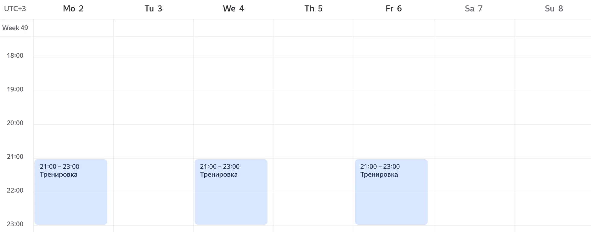

Давайте уточню немного про найм тренера.

Когда я беру нового сотрудника в IT-команду, мы проводим несколько этапов собеседования, чтобы понять уровень навыков. С тренерами в спортзале так не получится — но ведь с ними вы будете проводить **часы** вместе. Поэтому выбирать случайно — плохая идея.

Можно, конечно, позже поменять тренера или вообще отказаться, но учтите, что будут [последствия](https://www.tiktok.com/@ddx_fitness/video/7067562142702013698?lang=ru).

Вот мои три простых критерия:

1. **Внешний вид тренера**\
   Тренер должен быть в хорошей форме. Это как визитная карточка: если сам не смог привести себя в порядок, как он поможет вам?

2. **Внимание к ученику**\
   Тренер должен следить за вами, а не залипать в телефоне. Особенно на начальном этапе он контролировать технику и подсказывать. Со временем, когда вы станете опытнее, контроль можно ослабить, но не сразу.

3. **Совпадение по вайбу**\
   С тренером должно быть комфортно общаться. Важно, чтобы он был доброжелательным, не слишком строгим и не слишком расслабленным. Всё-таки вам предстоит много времени вместе.

## 3. Реализация проекта

На первые тренировки я ходил сам, без тренера.

- Делал простые упражнения с легким весом — чтобы не травмироваться.
- Между подходами наблюдал за работой тренеров и их взаимодействию с учениками.
- За пару тренировок сразу смог выделить тех, кто в форме — обычно 30% тренеров можно сразу вычеркнуть.
- Также становится понятно, кто реально помогает ученикам, объясняет и следит за техникой — после этого этапа отсеется еще треть.
- Оценить "вайб" сложнее, но можно: кто шутит, кто поддерживает разговор, у кого доброжелательный голос.

Это мои критерии. Кому-то, наоборот, нужен строгий тренер, который будет подгонять и мотивировать. Главное — чтобы вам было комфортно и результат не заставил себя ждать.

В итоге я пошел к тренеру — [Алексею Орешкову](https://www.instagram.com/aleksey_oreshkov/). И забегая вперед скажу, что не ошибся :)

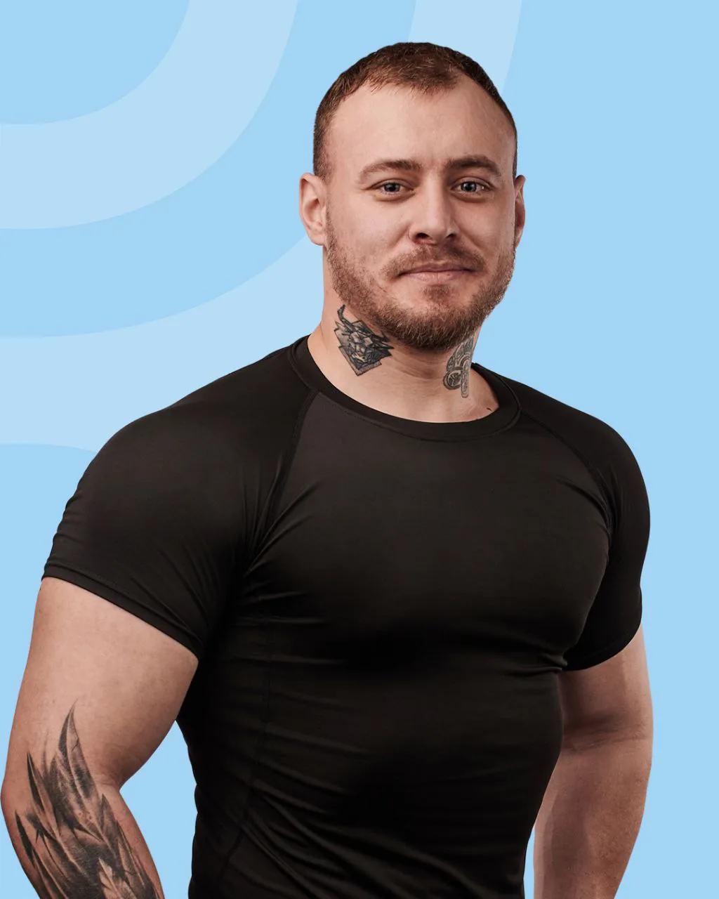

У моего тренера есть три "ступени" в тренировках:

1. **Начинающий** — привыкаем к нагрузке, смотрим как организм реагирует на физические упражнения.
2. **Любитель** — более сложная программа, с бОльшими весами, направлена на рост мышц и силы.
3. **Про** — те, кто готовится к соревнованиям.

Я, разумеется, попадаю в разряд "начинающий".
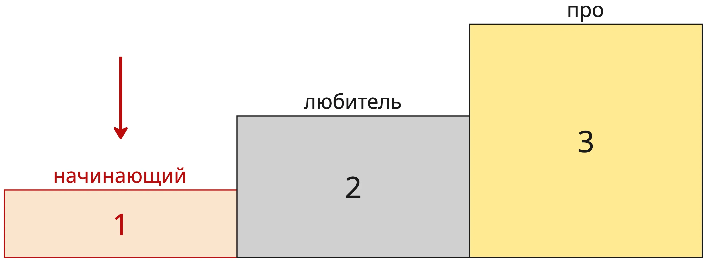

## 4. Мониторинг и контроль

Первое занятие — первое взвешивание на весах с анализом состава тела, чтобы получить отправную точку:
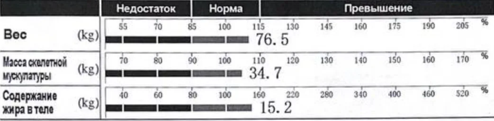

И весы также подтверидили на основе данных, что футболка топорщилась у меня не просто так:

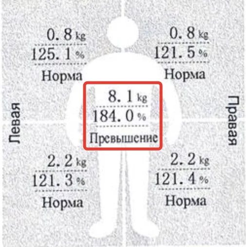

С тренером решили, что будем стремиться оставить вес примерно тем же, но уменьшить процент жира, т.е. будем делать рекомпозицию тела.

> Ходить в зал — недостаточно, нужно еще поменять пищевые привычки (с) Алексей Орешков

Даже если регулярно ходить в зал, но есть что попало, то добиться результатов не получится. Нужно покушаться на питание и убирать из рациона часть вкусняшек в пользу здорового питания.

Тренер дал мне следующие таргеты по питанию:

| Параметр | Цель |
|---|---|
| Калории | 1800–2000 ккал |
| Белки | 150 г |
| Жиры | 70 г |
| Углеводы | 200 г |
| Вода | 3 л |

Для подсчета калорий тренер посоветовал [приложение FatSecret](https://www.fatsecret.com/). Я до этого пользовался другими приложениями, но тут я решил полностью довериться.

Алексей еще предложил контролировать мое питание. Я присылаю скриншот моего питания, а он размечает "светофором" мой список:

* 🟢 — отличный выбор

* 🟡 — иногда можно

* 🔴 — лучше исключить

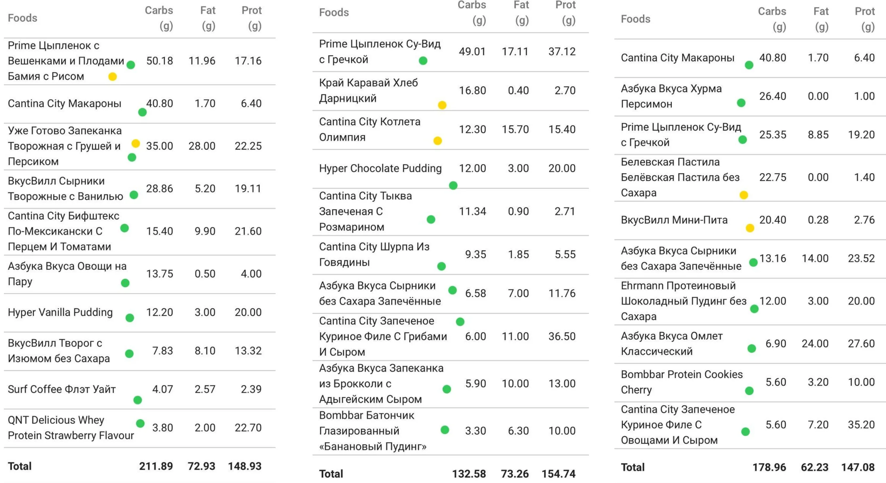

**Совет от Алексея по питанию:** нужно, чтобы средние значения за неделю соответствовали таргетам, т.е. если пару дней недоедать жиров/углей, то в выходной можно навернуть что-то покалорийнее. Это позволяет обходиться без срывов и иногда баловать себя вкусняшками.

Поэтому я нарисовал себе график скользящей средней и стал смотреть на нее. Например, потребление белка выглядело так.

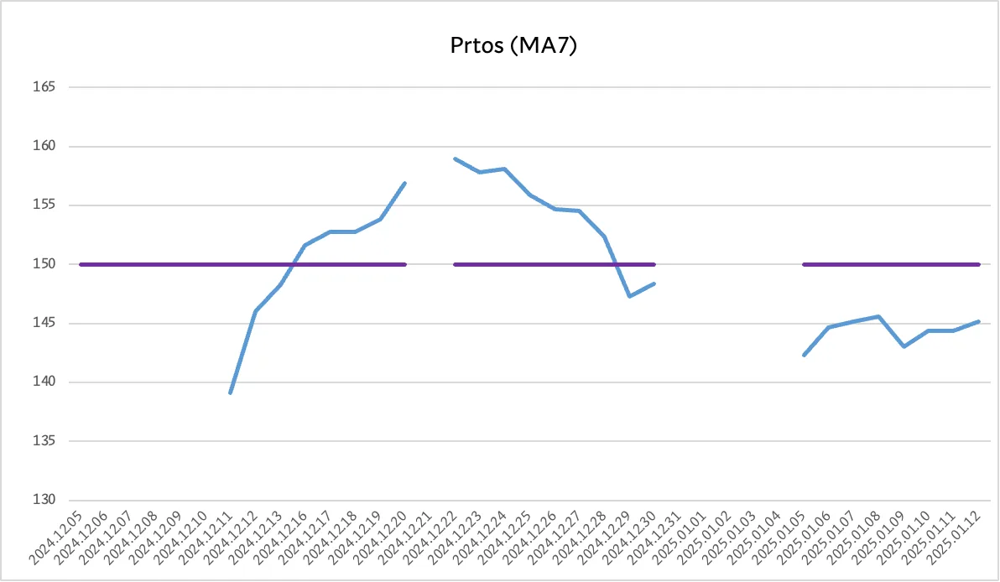

Воду я тоже трекал, но очень редко достигал заданного таргета. Нашел для себя лайфхак — купил литровую спортивную бутылку для воды и потребление воды сразу увеличилось.

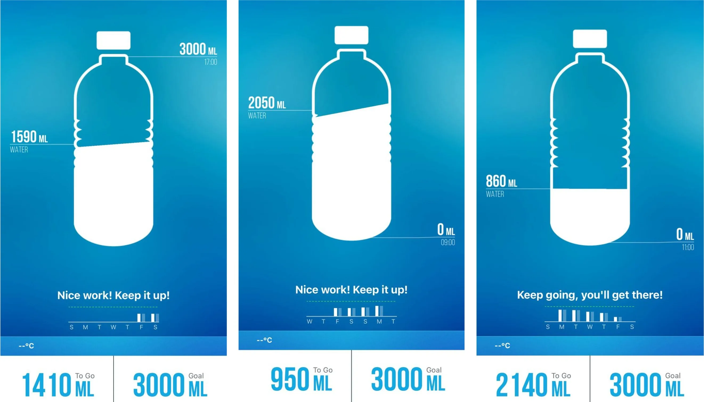

Т.к. мы с тренером переписываемся в телеграмм, то решил не искать какое-то отдельное приложение для записи тренировок. Просто создал набор тегов:

`#тренировка` — занятия
`#грудь` `#спина` `#ноги` `#плечи`— тип занятия
`#кардио` `#элипс` — кардио тренировки

`#баланс` — количество оплаченных тренировов

`#питание` — фотки кбжу из fatsecret
`#вода` — количество выпитой воды

Всегда можно отгрепать нужные сообщения одним кликом:
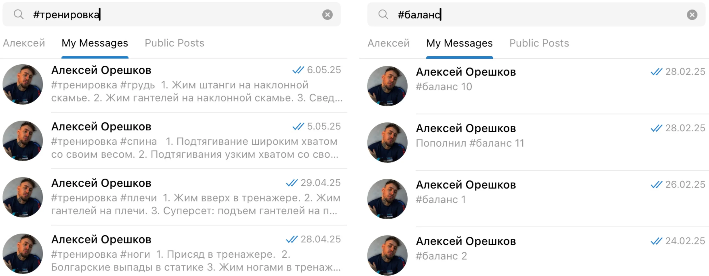

А, ну и куда же без кардио? Почти после каждой тренировки я еще делал кардио. В качестве отчета просто отсылал фото с нужными тегами:

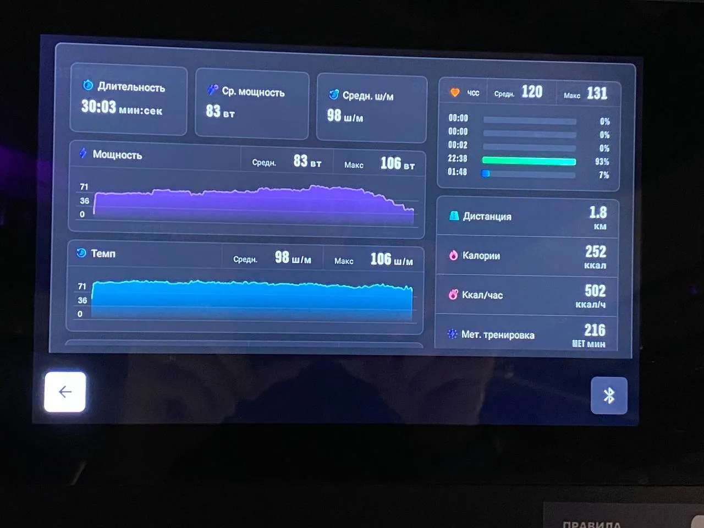

Важно было не допускать ЧСС выше 135 и стараться делать кардио больше 30 мин. Ну хотя бы 15 мин :)

Иногда я увлекался и пульс подскакивал выше 135, но в основном я более-менее укладывался.

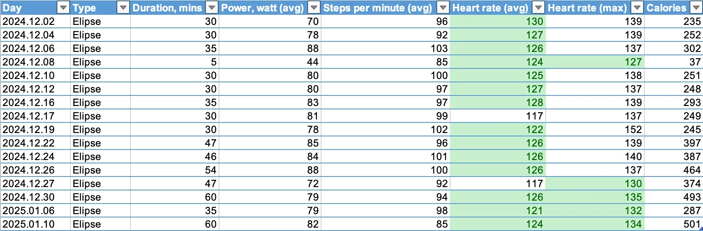

## 5. Завершение проекта

> Хороший тренер \+ усердный ученик = отличные результаты (с) Алексей Орешков

Напомню мою изначальную цель проекта: "**Посещать тренажерный зал 3 раза в неделю на полугода для поддержания физической формы и улучшения самочувствия.**"

Если проанализировать график тренировок ниже, то получим периодичность занятий в 2.5 тренировки в неделю. Очень близко к заявленной цели, что, на мой взгляд, вполне неплохо.

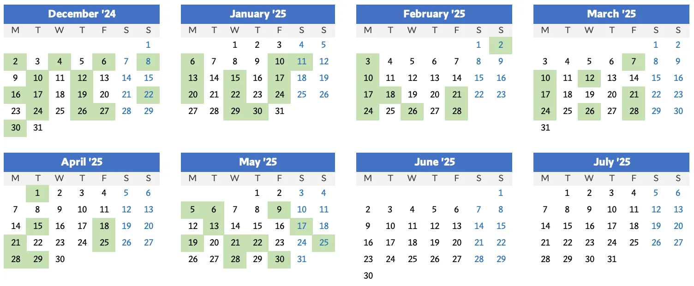

Но несмотря на послабление в питании и не совсем заявленное количество тренировок, удалось добиться рекомпозиции тела. Вес остался почти тем, что и до начала занятий, а вот состав претерпел изменения.

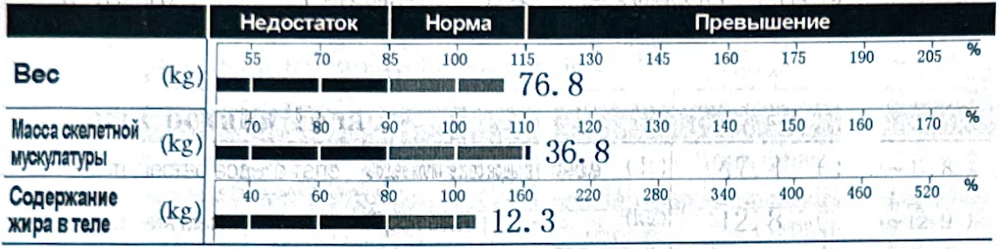

Нагляднее смотреть на результаты в динамике.
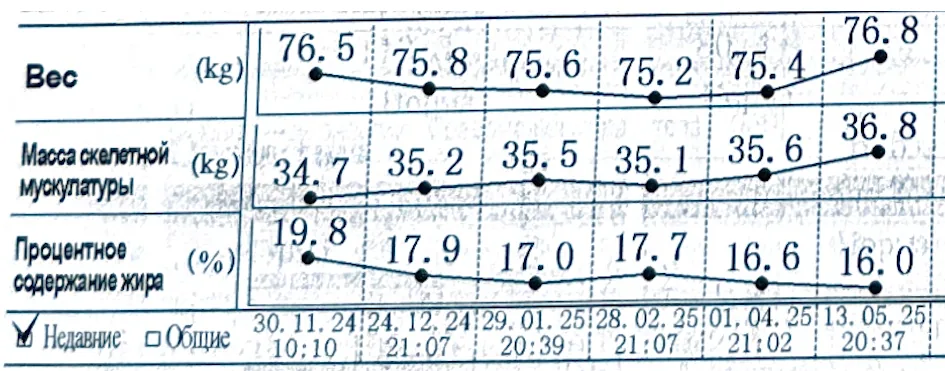

В итоге я перешагнул на следующую ступеньку у тренера. С этого момента тренировки стали тяжелее, объемы больше, а веса тщательно записываются и контролируются.

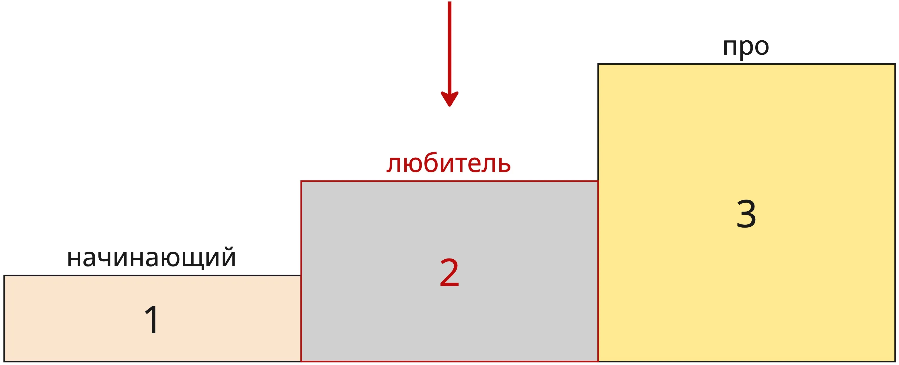

Если интересно продолжение, то поддержите статью лайком. Через полгодика напишу еще :)
