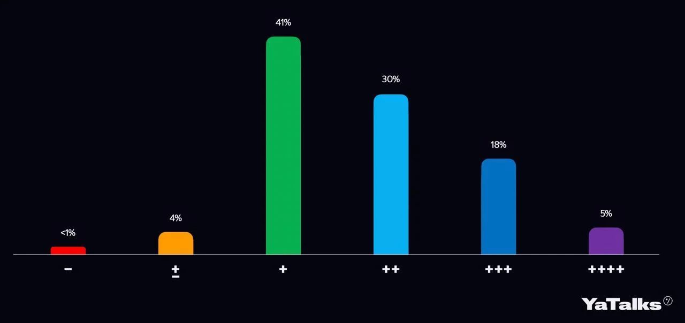


Оригинал опубликован в [Telegram](https://t.me/tarmolov_work/38)


  

Андрей Стыскин [показывал](https://disk.yandex.ru/i/N3X5E3YcPaLnsA) примерное распределение оценок по результатам ревью.

Зеленый столбик — это работа в рамках ожиданий. Как видно мы больше хвалим и меньше ругаем :)