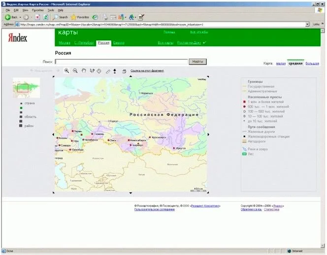


Оригинал опубликован в [Telegram](https://t.me/tarmolov_work/6)


  

Кстати, про первую версию Яндекс Карт.

Она состояла из фрагментов карты и если кто-то хотел посмотреть карту Москвы, то нужно было открыть одну вкладку, а если карту Санкт-Петербурга — то другую.

Также первую версию Яндекс Карт нельзя было драгать мышкой. Навигация осуществлялась стрелочками. Нажимаешь на стрелочку “вправо” и получаешь новый фрагмент карты. Захотел вернуться назад? Нажимаешь стрелочку “влево”. Любой клик приводил к полной перезагрузке страницы. Зато работало в любом браузере!

К слову, когда я присоединился к команде Яндекс Карт, то тачевая версия продолжала работать по той же логике. Под капотом использовался “тайловый принтер”, который по запросу отдавал фрагмент карты в виде картинке.

Позже мы выпустили “тайловый принтер” в виде [публичного API](https://yandex.ru/dev/maps/staticapi/) и теперь каждый желающий может повторить функциональность первой версии карт :)

\#гео