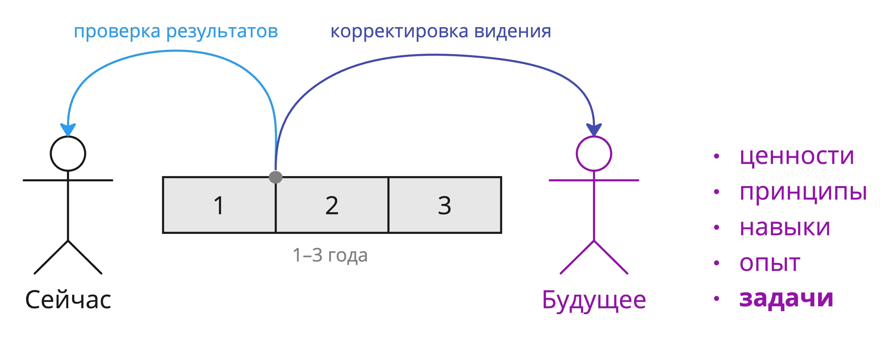


Оригинал опубликован в [Telegram](https://t.me/tarmolov_work/184)


 
Я уже [писал](https://tarmolov.ru/posts/176-voprosy-mne-kak-mentoru/), что большинство вопросов мне как ментору поступает про карьерное развитие.

Сперва я рекомендую сформировать видение будущего: ценности, навыки, опыт и т.д. Получаем своего рода "систему координат".

Самое важное — какие задачи хочется решать. Задачи формулируем на комфортном уровне абстракции, например, для себя я их описал [очень абстрактно](https://tarmolov.ru/posts/156-pro-shildik-rukovoditel-otdela/).

Планируйте задачи от 1 до 3 лет. Меньше года — слишком короткий срок для получения значимого результата, а дольше трех лет — обычно неподъемно для планирования :)

Периодически проводите ретроспективу движения и корректируйте картинку будущего. Это важный процесс!

Поймите, чем хочется наполнять свои рабочие будни, и увеличивайте количество таких задач. Только вы можете понять, что вам важно. Никто за вас их не придумает.

Опросите коллег, вдохновитесь [картой развития разработчика](https://tarmolov.ru/posts/214-karta-razvitiya-razrabotchikov/) и [книгами про навыки](https://tarmolov.ru/posts/225-stiven-kovi-7-navykov-vysokoeffektivnykh-lyudey/). Главное — получить список задач.

Это ваша отправная точка.