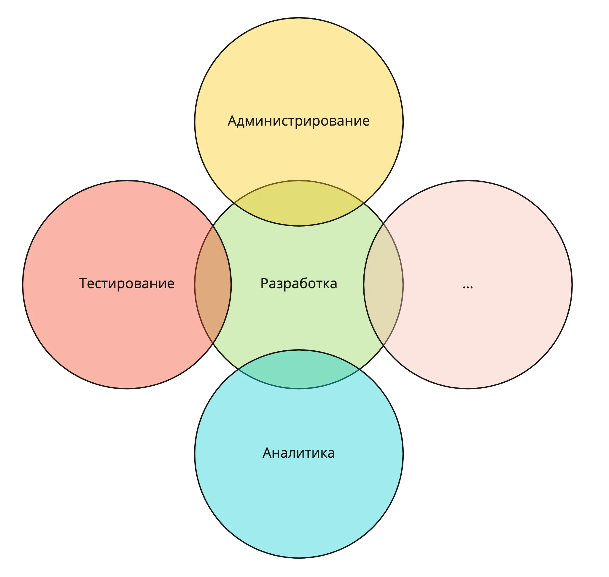


Оригинал опубликован в [Telegram](https://t.me/tarmolov_work/106)


Один из самых популярных запросов мне, как ментору, примерно следующий:
"Мои задачи — скучные. Хочу что-то интересное и челленджевое! Что делать?"

Интересные задачи легко находятся, если смотреть шире на свои текущие проекты. Мне нравится термин "метазадачи", который я подслушал у [Сережи Бережного](https://veged.ru/).

Если вам нужно делать лендинги каждый день, то можно делать лендинги. А можно сделать "метазадачу" — конструктор лендингов — и снять однотипные задачи с разработчиков.

Так вот, я обычно советую взглянуть на "стык" вашего подразделения со смежными. Например, "разработка—тестирование" или "разработка—аналитика".

Обычно в этих местах много нерешенных проблем, и можно нанести много добра.

Дерзайте ;)