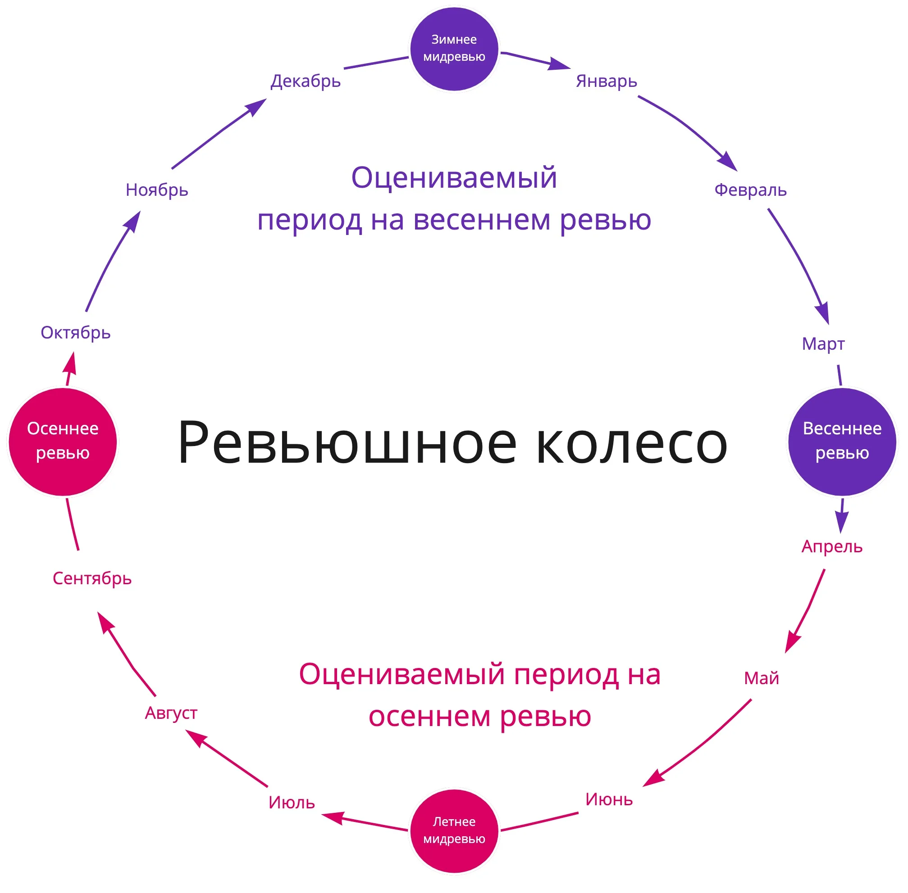


Оригинал опубликован в [Telegram](https://t.me/tarmolov_work/88)


В прошлом году я [рассказывал](https://tarmolov.ru/posts/13-chto-takoe-revyu/) о ревью в нашей компании. И даже рисовал [ревьюшное колесо](https://tarmolov.ru/posts/14-revyushnoe-kolesa/) для наглядности.

Пришло время обновить схемку и добавить еще один этап.

**Мидревью** — промежуточный этап. Он находится на "экваторе", т.е. примерно в середине ревьюшного периода.

Основная задача мидревью — подведение промежуточных итогов. Обычно руководитель и сотрудник и так синхронизируются в процессе работы.

Однако мидревью заставляет нас подойти серьезнее к этому процессу:

* зафиксировать текущие результаты
* обновить планы на вторую половину оцениваемого периода

P.S. Тем не менее, анонс мидревью встречается возгласом: "Мы же только начали работать! Неужели уже квартал прошел?" :)