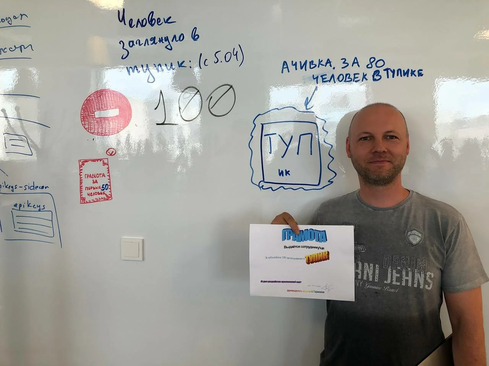


Оригинал опубликован в [Telegram](https://t.me/tarmolov_work/66)


В офисе моя команда сидит на шестом этаже в углу опенспейса. Так получилось, что на пятом этаже есть проход в соседний корпус, а на шестом — нет.

Из-за этого коллеги часто ошибаются и заходят в нашем углу в тупик.

Мы даже завели счетчик на маркерной стене. Увеличивали счетчик на каждого посетителя тупика. Когда счетчик пробил полсотни незапланированных посетителей, то мы создали тикет нашим хелпам по улучшению навигации.

Решение этой задачки затянулось, и счетчик пробил сотню. Мы вручили "грамоту" сотому посетителю.

Фотографию приложили в тикет в качестве доказательства, что проблема актуальна :)