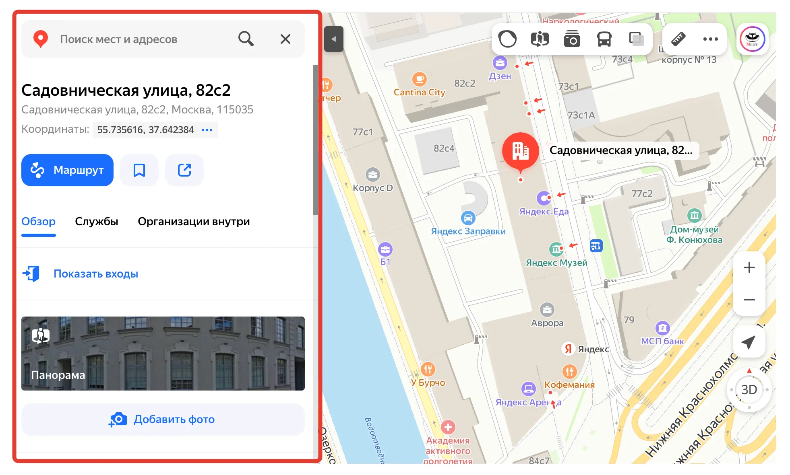


Оригинал опубликован в [Telegram](https://t.me/tarmolov_work/201)


 
Мы постоянно проводим [a/b эксперименты](https://tarmolov.ru/posts/88-chto-takoe-ab-eksperimenty/) для пошагового улучшения наших сервисов.

Один из таких экспериментов был про перенос панели с результами поиска из правой части интерфейса:
* провели a/b эксперимент с подсчетом метрик
* перенесли панель налево и запустили обратный эксперимент
* после окончания обратного эксперимента убедились, что все ОК

Через некоторое время нам приходит эмоциональное письмо от уставшего пользователя: 
"Ребята, ну сколько можно? Я привык, что результаты поиска показываются справа. В какой-то день захожу в карты и вижу результаты слева. Стал привыкать. Через пару недель результаты опять перепрыгнули направо. Я вздохнул и стал опять привыкать. А потом результаты опять перенеслись влево! Вы уж определитесь, пожалуйста!"

Наш бедный пользователь попал во все эксперименты, включая обратный. Безжалостная формула по выбору пользователей не учла этого факта.

Дорогой пользователь, прости нас, пожалуйста!