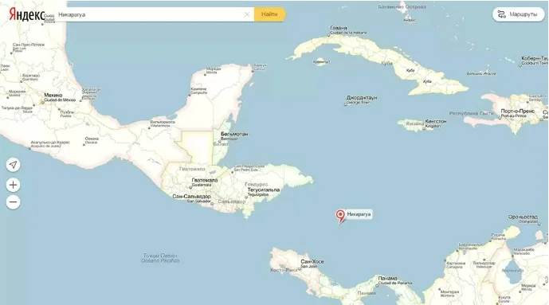


Оригинал опубликован в [Telegram](https://t.me/tarmolov_work/150)


Чтобы получилась карта, необходимы два компонента: данные и рендерер карты.

Даже если сам рендерер написан без багов, баг может закрасться в данных. Так и получилось. Незамкнутый многоугольник привел к тому, что “залили водой” целую страну Никарагуа.

В любом графическом редакторе при использовании инструмента “Заливка” может случиться похожий “Упс!”, и вместо небольшого контура окрасится половина изображения.

Наш инцидент с затоплением Никарагуа произошел несколько лет назад, но помним мы его до сих пор, как напоминание быть более осторожными и внимательными. 

С тех пор мы улучшили процесс тестирования данных, дизайна карты и процесса выкладки. Теперь страны мы точно не зальем ;)