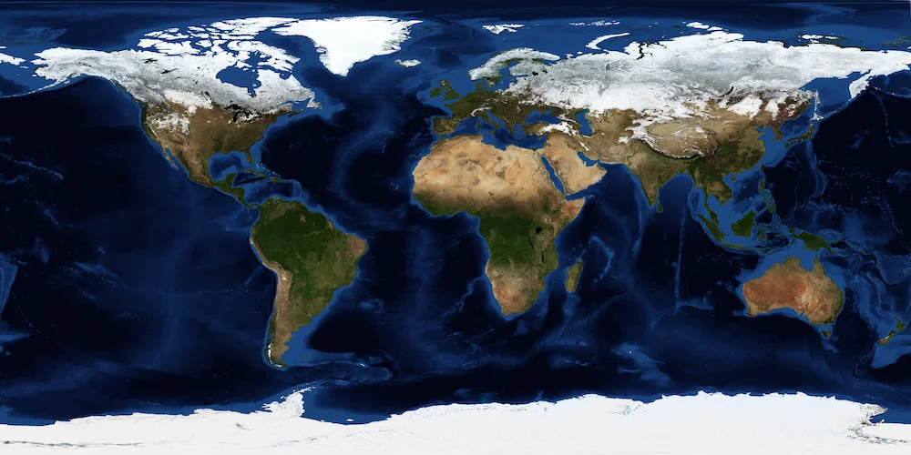


Оригинал опубликован в [Telegram](https://t.me/tarmolov_work/65)


[Откройте режим спутника](https://yandex.ru/maps/?l=sat&ll=31.349154%2C38.356723&z=2) в Яндекс Картах на масштабе, когда видны все континенты. На этом масштабе океаны имеют насыщенный синий цвет.

Это изображение поверхности Земли называется [Blue Marble](https://en.wikipedia.org/wiki/The_Blue_Marble). Фотография сделана NASA и является общественным достоянием.